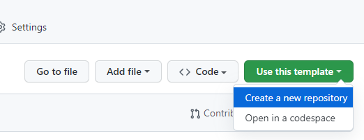
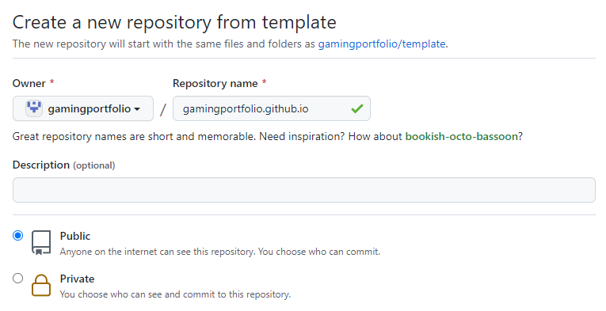
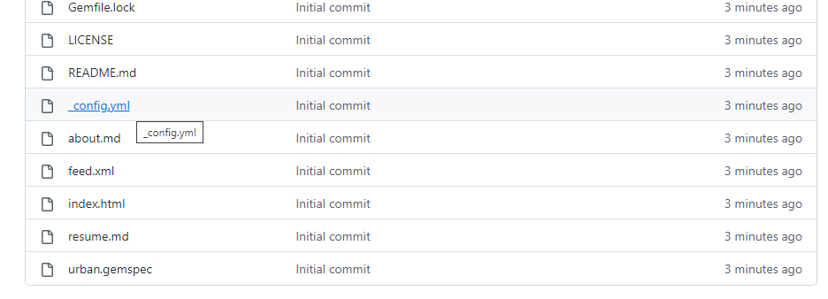
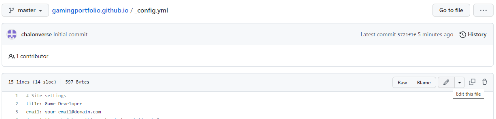
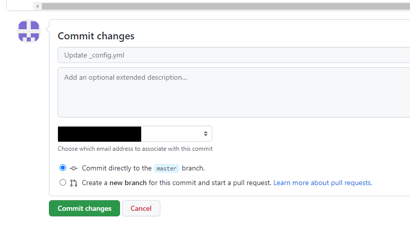

# Urban Theme (Portfolio) Quick Start

## Sample

Here is a sample of what a portfolio might look like with this theme: [https://gamingportfolio.github.io/](https://gamingportfolio.github.io/). The repository for the sample page is [here](https://github.com/gamingportfolio/gamingportfolio.github.io).

## Setting up on GitHub Pages

1. If you do not have a GitHub account yet, create one and login with it
2. From the [gamingportfolio/template](gamingportfolio/template) page on GitHub, select "Use this template" and click "Create a new repository":
   
3. From this page, keep the owner either as your GitHub username (or if you have an organization you want to use, select the organization). The repo name should be named `githubname.github.io`. For example, if I'm making it for the `gamingportfolio` organization, I would use `gamingportfolio.github.io`. Make sure this repo is ***public*** (otherwise, you will need a paid/pro account to host on GitHub pages).
   
4. After a few moments, it will create your copy of the template
5. Click on the `_config.yml` file listed in the root of the repository:
   
6. From this page, click on the "Edit this file" button on the right, above the file:
   
7. This file contains some basic configuration settings for your website. You should change the following:
   * `title:` - Put your name here
   * `email:` - Put the email address to contact you
   * `description:` - Use this to summarize your skills
   * `url:` - This should be `https://githubname.github.io` where `githubname` is the user/org you are making the site for
   * `linkedin_url:` - Put your public LinkedIn profile URL here
   * `github_username:` - (Optional). If you want to link to your GitHub page, you can do that with this property. Alternatively,  remove this line if you don't want to link it
   * `twitter_username:` - (Optional). If you want to link to your Twitter account, you can do that with this property. Alternatively, remove this line if you do not want it.
   * `footer_text:` - The default text just gives attribution to this theme, but you can change it to add whatever additional items you want
8. Click on the "Commit changes" button at the bottom of your page:
   
9. 1-2 minutes after committing your change, the page will go live at [https://githubname.github.io](https://githubname.github.io).
10. Once your site is live, you can keep making changes! Note that in many cases, after making your changes you may have to wait 1-2 minutes and then "refresh" the page in your browser to see the updates.

## Markdown

Almost all text content on the portfolio site uses Markdown. If you've never edited Markdown files before, they are text files with some additional special characters that allow you to format the text. Here is a [quick guide](https://ghost.org/changelog/markdown/).

## Images

The header image in `assets/header.png` appears at the top of each page. The recommended size of this is  500x150.

For each post (which corresponds to a game or other item on your portfolio), you should make a preview image that's 300x300, and put this image in the `assets` folder.

Content on the main pages (including about or resume) should have images that are 800 pixels wide for best results. The height can vary, but for reference 800x450 is a 16:9 aspect ratio which is common for games.

To reference one of your images in Markdown, you should include `/assets/` in front of the image name, for example:

```markdown

```

## Resume

The resume is in `assets/resume.pdf`. Simply replace this PDF with your own (using the same name), and it will update. 

You can change the text that appears before or after your resume in the resume.md file. (Leave the `<object>` parts intact so it shows the PDF).

## About

For the about page, I recommend including an image (though you can remove it if you don't want it).

## Posts

Each project/game you want to list should have a separate `.md` file in the `_posts` folder. The template starts with 6 posts, but you can increase or decrease the number of files as desired.

I recommend sticking with the default post file naming convention of `YYYY-MM-DD-postname.md`.

Inside each post file, there is some basic information that you will need to change for each post:

* `title:` - This is what will appear immediately below the preview image on the main page, and at the top of the post page
* `summary:` - Here you should put a brief description of your role on the project
* `date:` - The date is relevant only because it determines the order in which the posts appear. The newest post will appear in the top left corner of the grid in the home page, so you want to make sure the dates are ordered such that your older projects have older dates
* `preview:` - This is the name of the preview image you want to use, that will appear on the grid on the home page

After the second line with `---`, you can edit the rest of the file with normal markdown syntax to add whatever relevant information about the project you want to add, including various images, bullet points of what you worked on, videos, browser-playable versions of the game, etc.

## Editing Files Locally

While you can edit all of your files through the GitHub website if you want to, you also can"clone" a copy of your repository and access all the files locally and then "push" them back to GitHub. If you haven't used GitHub before, [GitHub Desktop](https://desktop.github.com/) makes it relatively painless to get a copy of your files and push them back to the server. For large changes, this workflow is recommended as opposed to editing the files through the website.

## Questions?

If you have any questions, feel free to post in the [discussions](https://github.com/gamingportfolio/template/discussions).

## Acknowledgements

This is largely based on the original [urban-theme](https://github.com/midzer/urban-theme). See LICENSE for full licensing information.
